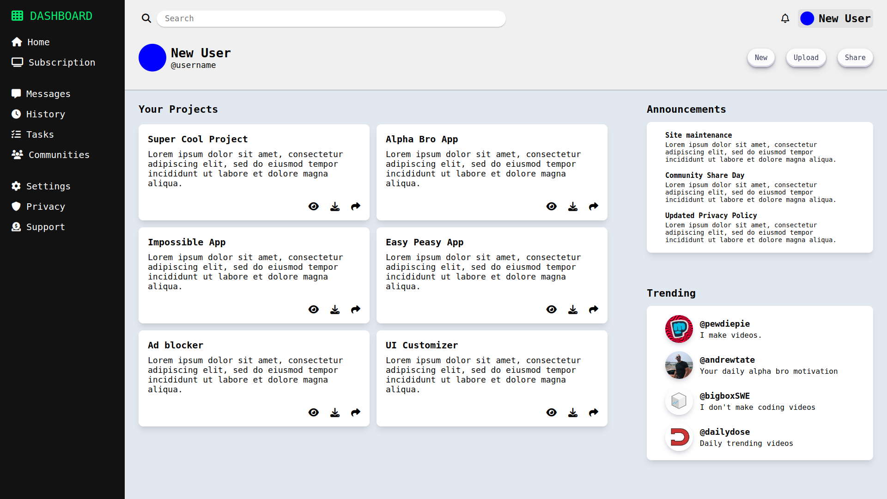

# Admin Dashboard
## Live Preview <a href="https://afnsami.github.io/admin_dashboard">HERE</a>

This is the project where I had to use my Grid knowledge

Although I used flex more than grid, I somewhat understood how to work with grid, and how to combine flex with grid.

My classes have started, so I can't give time on TOP like I used to, but still, I making good progress.

I finished this project in <b>28 days</b> to finish. I started this on <b>24 February</b> and finished it on <b>22 March</b>.

